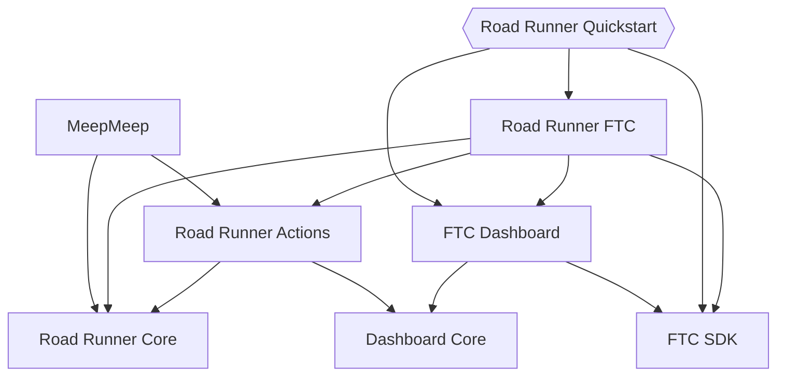

# Modules

Ever wondered why there are so many modules and repositories in the Road Runner
ecosystem? It's all to do with dependencies. The fewer dependencies a module
has, the more places and situations it can be used. For Road Runner, the main
dependency to avoid is the FTC SDK. The SDK integrates heavily with the Android
libraries, making it difficult to run on a non-Android machine. But even beyond
those practical concerns, it's good to keep conceptually separate bits of code
in different modules. Road Runner and FTC Dashboard may have great synergy when
used together, but the core functionality of Road Runner is totally independent
of FTC Dashboard so neither of those modules depend on each other.

The major modules and their dependencies are shown in this diagram:

The quickstart node has a different shape because it isn't a fixed module in the
same way that the others are. It's a template that teams take and customize to
fit their needs.

<!-- # Why are there so many different libraries?

Road Runner is really a set of libraries.

* `core` has the base types and math. It only depends on the Kotlin standard
  library, and there's nothing tying it to FTC. Most users will probably want to
  interact with RR through `actions`, though this is available for users that
  only need to integrate at a low level.

* `actions` builds an asychronous programming system on top of `core` that's
  designed to run with FTC Dashboard. However, it only depends on the dashboard
  `core` library and not the full dashboard board module (with its transitive
  dependence on the FTC SDK). This is the best target for GUIs and other tools
  that interact with RR offline (not in the Robot Controller app). 

* `ftc` bundles togetherall of the code that depends on the FTC SDK,
  including tuning utilities and (transitively) full FTC dashboard. This is
  target to depend on in `TeamCode`.

* `playground` (TODO: anything to say here?)

The libraries are hosted in separate repositories. `core` and `actions` are in
the [main repo](TODO: link), while `ftc` is in its own [FTC SDK project](TODO:
link).  -->
