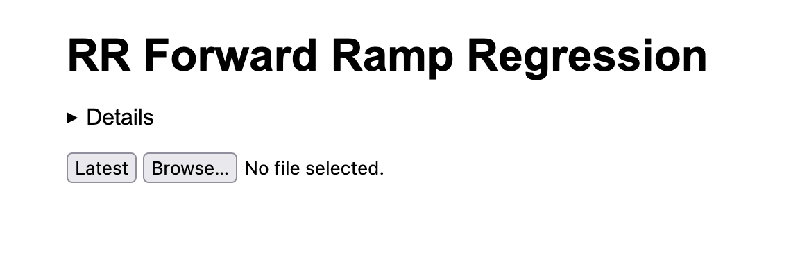
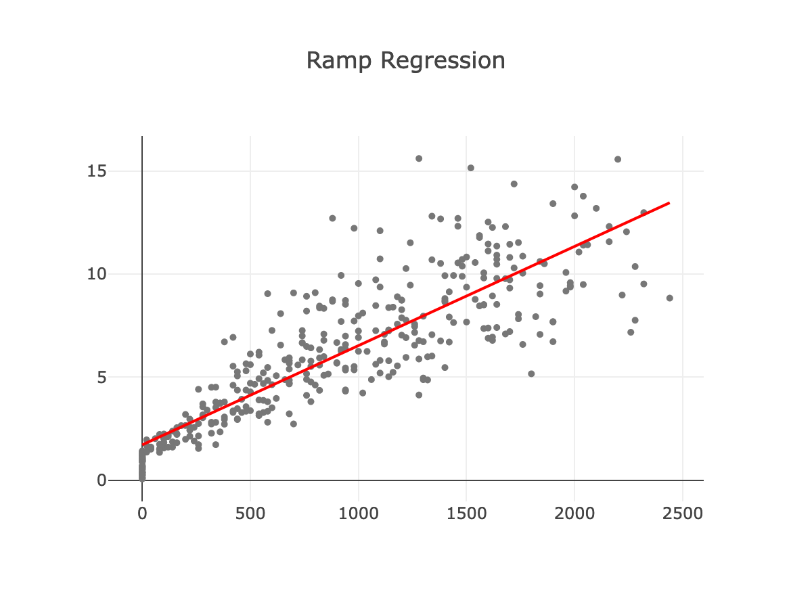
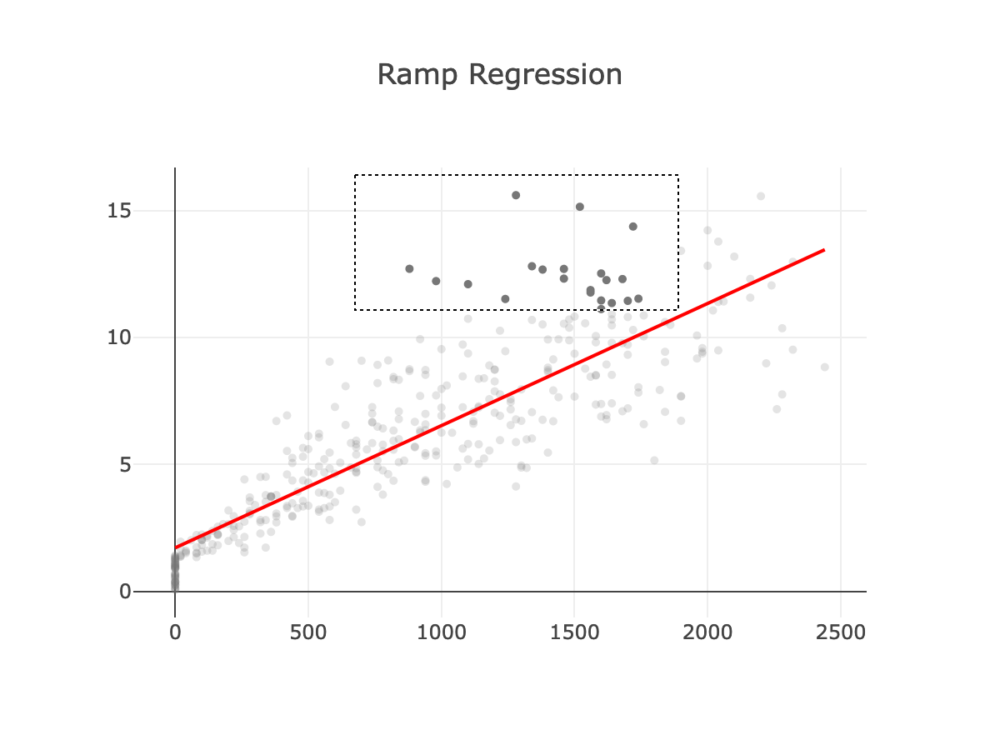
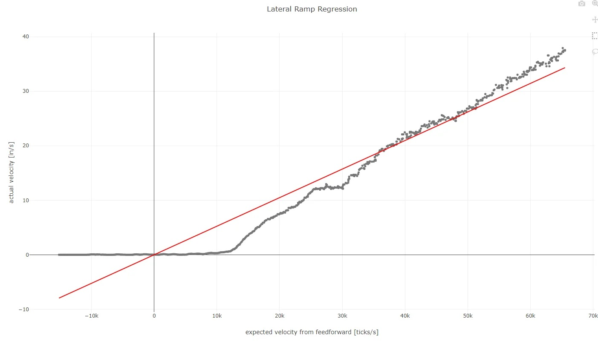

# Tuning

For Road Runner to work best, it needs to be tuned to your robot. This process
involves running several op modes and adjusting a set of parameters that capture
the behavior of the bot. The entire affair shouldn't take more than a few hours,
and it can go much faster once you know the ropes.

**Read this page very carefully**, especially if it's your first time. Most details
are only mentioned once and you don't want to miss them. Failing to fully
complete one step in the sequence will often affect the next step, and you may
be forced to start over when you don't get satisfactory results at the end.

There are also some steps that only apply to mecanum drives or vary depending on
whether you're using drive encoders or dead wheels for localization. Pay
attention to these directives and only complete the steps you need.

Once you've finished tuning properly, your robot should be able to execute
pretty much any path you can specify. The shape of the path and the battery
voltage shouldn't significantly affect following. But the tuning can easily
become out of date if weight is added or removed from the robot, encoders/motors
are changed, or other major modifications are made. You may find yourself
retuning the robot several times during the season, and it may help to practice
the motions well before competition.

Make sure you have [downloaded a quickstart project](../installation) and opened
it in Android Studio. Basic familiarity with FTC programming in Android Studio
will help immensely. Consider reading through [Learn Java for
FTC](https://github.com/alan412/LearnJavaForFTC/blob/master/LearnJavaForFTC.pdf)
and writing some of your own op modes before continuing.

## Getting Help

Try asking the community over on the [FTC Discord](https://discord.com/invite/first-tech-challenge).
Many people over there have gone through the tuning process and can give the most
practical advice for you and your team.

Make sure you're running the [latest version](https://github.com/acmerobotics/road-runner-ftc/tags)
of the library. You can check and update the library version in the `TeamCode/build.gradle` file
on the line that looks like `implementation "com.acmerobotics.roadrunner:ftc:LIBRARY_VERSION_HERE"`.

If all else fails, open an issue [here](https://github.com/acmerobotics/road-runner-quickstart/issues)
with as much information as you can supply:
* Tuning files (click the "Download" button on any tuning page)
* Link to robot code (GitHub repository or something)
  - Version of the library you're using.
* Robot logs (download from `http://192.168.43.1:8080/logs`)

<!-- ## Glossary

TODO: work on this, see https://learnroadrunner.com/before-you-start.html#terms-to-know

This guide and the code uses technical terms that you might not have heard
before. Here are some definitions.

* Localization:
*  -->

## Drive Classes

**Goal: get basic hardware configured**

Open either `MecanumDrive` or `TankDrive` depending on your bot.

* `MecanumDrive`: The class assumes your four wheel motors are named
  `"leftFront"`, `"leftBack"`, `"rightBack"`, and `"rightFront"` and your IMU is
  named `"imu"`.
* `TankDrive`: The class stores the left and right motors in `leftMotors` and
  `rightMotors`, respectively. To start, the class puts motors named `"left"`
  and `"right"` in the appropriate lists. If you have more motors, add them to
  the `Arrays.asList(...)` expression.

Set the logo and USB direction of your IMU using the instructions on [this page](https://ftc-docs.firstinspires.org/en/latest/programming_resources/imu/imu.html?highlight=imu#physical-hub-mounting).

Feel free to change the default hardware names to match you robot configuration.
For more information, check out the [FTC docs](https://ftc-docs.firstinspires.org/en/latest/hardware_and_software_configuration/configuring/index.html).

In `TuningOpModes`, set the `DRIVE_CLASS` variable to the drive class you're
using.

Then specify how the robot should track its position. There are a few built-in
localizers:
* **Drive encoders**: This is the default. The IMU will also be used on mecanum to
  get better heading.
* **Two (dead) wheel**: Change the right-hand-side of `localizer = `&nbsp;
  ([mecanum](https://github.com/acmerobotics/road-runner-quickstart/blob/5f35f4c22c1ae7c0be5b35da0961c8f3a181ad31/TeamCode/src/main/java/org/firstinspires/ftc/teamcode/MecanumDrive.java#L240),
  [tank](https://github.com/acmerobotics/road-runner-quickstart/blob/5f35f4c22c1ae7c0be5b35da0961c8f3a181ad31/TeamCode/src/main/java/org/firstinspires/ftc/teamcode/TankDrive.java#L247))
  to `new TwoDeadWheelLocalizer(hardwareMap, lazyImu.get(), PARAMS.inPerTick)`.
  The code expects the parallel, forward-pointing encoder to be named `"par"`
  and the perpendicular one to be named `"perp"`.
* **Three (dead) wheel**: Change the right-hand-side of `localizer = `&nbsp;
  ([mecanum](https://github.com/acmerobotics/road-runner-quickstart/blob/5f35f4c22c1ae7c0be5b35da0961c8f3a181ad31/TeamCode/src/main/java/org/firstinspires/ftc/teamcode/MecanumDrive.java#L240),
  [tank](https://github.com/acmerobotics/road-runner-quickstart/blob/5f35f4c22c1ae7c0be5b35da0961c8f3a181ad31/TeamCode/src/main/java/org/firstinspires/ftc/teamcode/TankDrive.java#L247))
  to `new ThreeDeadWheelLocalizer(hardwareMap, PARAMS.inPerTick)`. The code
  expects the two parallel encoders to be named `"par0"` and `"par1"` and the
  perpendicular one to be named `"perp"`.


If you choose to use dead wheels, drive encoders are not needed, and those
encoder ports can be used for dead wheel encoders. You can change the names in
`TwoDeadWheelLocalizer`/`ThreeDeadWheelLocalizer` to reflect the motor names of
the slots the encoders were connected to.

Note that, for [technical
reasons](https://blog.eeshwark.com/robotblog/rev-hub-quadrature), ports 0 and 3
on REV hubs are more accurate at high speeds and should be used for the parallel
dead wheels.



Check out
[gm0](https://gm0.org/en/latest/docs/common-mechanisms/dead-wheels.html) for
more details on dead wheels, including advice on mechanical design.


Now check that the motors spin in the right direction. Positive power on all
wheels should move the robot forward. And if you're using drive encoders, the
ticks recorded should increase in a positive direction.

Those with mecanum drives should use `MecanumDirectionDebugger` to make sure
all the directions are correct. The op mode uses the following button mappings:

```
/**
 * Xbox/PS4 Button - Motor
 *   X / ▢         - Front Left
 *   Y / Δ         - Front Right
 *   B / O         - Rear  Right
 *   A / X         - Rear  Left
 *                                    The buttons are mapped to match the wheels spatially if you
 *                                    were to rotate the gamepad 45deg°. x/square is the front left
 *                    ________        and each button corresponds to the wheel as you go clockwise
 *                   / ______ \
 *     ------------.-'   _  '-..+              Front of Bot
 *              /   _  ( Y )  _  \                  ^
 *             |  ( X )  _  ( B ) |     Front Left   \    Front Right
 *        ___  '.      ( A )     /|       Wheel       \      Wheel
 *      .'    '.    '-._____.-'  .'       (x/▢)        \     (Y/Δ)
 *     |       |                 |                      \
 *      '.___.' '.               |          Rear Left    \   Rear Right
 *               '.             /             Wheel       \    Wheel
 *                \.          .'              (A/X)        \   (B/O)
 *                  \________/
 */
```

Reverse any motors running in the wrong direction with `setDirection(...)`,
and do the same for corresponding drive encoders as well.

If you're using dead wheels, run `DeadWheelDirectionDebugger` and reverse those
encoders accordingly.


The direction of each `Encoder` is **independent of the `DcMotorEx` it's
created with**. Changing the direction of an `Encoder` has no effect on the
direction of its associated `DcMotorEx` (and vice versa).


Each of these items has a `TODO` comment in the code. These comments are
highlighted, and you can see a list of all of them in the [TODO tool
window](https://www.jetbrains.com/help/idea/using-todo.html) at the bottom of
Android Studio. It may help to delete the comments as you complete them to keep
track of your progress.

## FTC Dashboard

Many steps require using [FTC
Dashboard](https://acmerobotics.github.io/ftc-dashboard), a tool for monitoring
and debugging FTC applications. It comes installed by default with the
quickstart repository.

Start by [connecting your computer to the Program & Manage
network](https://ftc-docs.firstinspires.org/en/latest/programming_resources/shared/program_and_manage_network/Connecting-a-Laptop-to-the-Program-%26-Manage-Network.html).
Navigate to `http://192.168.43.1:8080/dash` (if you're using a phone as your
Robot Controller, go to `http://192.168.49.1:8080/dash` instead). You can read
more about the supported features in [the
docs](https://acmerobotics.github.io/ftc-dashboard/features). The most important
for tuning are config variables and live graphing.

<!-- TODO: Is it easy to make a demo video and put it here? -->

## `ForwardPushTest`

**Goal: determine `inPerTick` empirically**

Place the robot on the tiles with plenty of room in front. Square the robot up
with the grid and make note of its starting position. Run `ForwardPushTest` and
then slowly push the robot straight until the end of the tiles. Record the "ticks
traveled" from telemetry before stopping the op mode. Without moving the robot,
record also the forward distance traveled on the tiles in inches. Set the
`inPerTick` variable in your drive class to the real distance traveled divided
by the ticks traveled.

Make sure the wheels don't slip! The motors should spin freely. If the bot is
too light or otherwise slipping, you can use theoretical values for ticks per
revolution, gear ratio, and wheel diameter to compute `inPerTick` instead.


If the ticks traveled is close to zero no matter how far you push, the motors on
one side are probably reversed. Go back to the previous step and double check
the encoder directions.


## `LateralPushTest` (mecanum with drive encoders only)

**Goal: determine `lateralInPerTick` empirically**

This routine is simply a version of `ForwardPushTest` that measures leftward
motion instead of forward motion. Set the robot up as before, slowly push it
left, and set `lateralInPerTick` to the distance divided by ticks. The value
you get should be positive.

The measured value includes the inevitable strafing slip (previous versions
compensated for this explicitly with `lateralMultiplier`), so you should expect
it to be smaller than `laterInPerTick` by a modest amount.

## `ForwardRampLogger` (dead wheels only)

**Goal: determine `kS`, `kV` empirically**

This routine slowly increases the forward power given to the robot and measures
the forward velocity over time to calculate the static and velocity feedforward
parameters (`kS` and `kV`, respectively). By default, the power will increase by
0.1 each second until it reaches 0.9.

Place your robot on the tiles with as much distance in front of it as possible.
Start the op mode and press stop immediately when the robot nears the edge of
the tile. Don't expect anything to be displayed in telemetry. All data collected
is saved to a file for further analysis.

Once you finish, connect your computer to the RC wireless network using [these
instructions](http://ftc-docs.firstinspires.org/programming_resources/shared/program_and_manage_network/Connecting-a-Laptop-to-the-Program-%26-Manage-Network.html).

* If you have a control hub, navigate to
  `http://192.168.43.1:8080/tuning/forward-ramp.html`.
* If you have a RC phone, navigate to
  `http://192.168.49.1:8080/tuning/forward-ramp.html`.

From now on, I'll use Control Hub URLs.

You should see a page that looks like this:



Click the "Latest" button, and you should see a graph appear:



The gray points are the measurements made by the tuner, and the red line is the
line of best fit. Its from this line that the feedforward parameters will be
extracted. In fact, you can see preliminary values for `kS` and `kV` already
displayed above. But those estimates are limited by the presence of outliers.
You can see that the red line doesn't quite fit the trend. Let's help the
algorithm out by manually filtering out outlier points.

First, click and drag to select a rectangular region of the plot:



Then to remove those points, press the "e" key or the "exclude" button above.
The selection box will disappear, and the points will turn a lighter gray. After
repeating this process as many times as necessary, you should end up with a plot
like this:


Now you can copy the values above the plot into the `kS` and `kV` fields in the
drive class.

If you mess up and accidentally exclude non-outlier points, select them and
press "i" or click the include button to bring them back into the calculation.

If you have issues or the data looks weird, click the "Download" button to
retrieve your data and include it when asking for help.

## `LateralRampLogger` (mecanum with dead wheels only)

**Goal: determine `lateralInPerTick` empirically**

If all is configured correctly, the logger OpMode will move the robot to the left,
increasing in speed as it goes (similar to `ForwardRampLogger`). Stop it at any point,
keeping in mind that longer runs will collect more data.

When you're done, go to `http://192.168.43.1:8080/tuning/lateral-ramp.html` and click
the "Latest" button. The slope reported is `lateralInPerTick`.


A multiplicative factor alone unfortunately doesn't adequately capture the
strafing behavior of most robots. It's common to see a plot with a plateau in
the beginning:



There's nothing much to be done about the poor fit during tuning. Future
versions of Road Runner may change the strafing model to get a better fit
(progress will be tracked on [this
issue](https://github.com/acmerobotics/road-runner-ftc/issues/4)).


## `AngularRampLogger`

This routine is very similar to the last except that it rotates in place instead
of moving forward. As before, you can change the power ramping parameters inside
the `power()` method. Run the routine using the same instructions.

### Drive Encoders

**Goal: determine `trackWidthTicks`, `kS`, and `kV` empirically**

Go to `http://192.168.43.1:8080/tuning/drive-encoder-angular-ramp.html` and click
the "Latest" button. Use the instructions from the `ForwardRampLogger` analysis
to get `kS`, `kV` from the the "Ramp Regression" plot. Then use the same
outlier-exclusion technique on the "Track Width Regression" and set
`trackWidthTicks` to the "track width" value when you're finished.

### Dead Wheels

**Goal: determine `trackWidthTicks` and odometry wheel locations empirically**

Go to `http://192.168.43.1:8080/tuning/dead-wheel-angular-ramp.html` and click
the "Latest" button. Copy the `kS` and `kV` values from `ForwardRampLogger` into
the appropriate boxes and click the "update" button. Use the instructions from the
`ForwardRampRegression` analysis to fill in `trackWidthTicks` in your
drive class and the wheel position fields in your dead wheel class. **There should
be multiple plots. Scroll down to make sure you don't miss any.**


To get an accurate `trackWidthTicks` value, you need accurate values for `kS`,
`kV`.


## `ManualFeedforwardTuner`

**Goal: Fine-tune `kS`, `kV` and add in `kA`**

This routine repeatedly drives forward and back `DISTANCE` units, giving you an
opportunity to finalize the feedforward parameters.

Open FTC Dashboard by navigating to `http://192.168.43.1:8080/dash`. Run the op
mode, and graph `vref` against `v0`. Set `kA` to a small value like `0.0000001`
and slowly increase it by a factor of ten until it starts effecting the plot.
Try to make the two lines in chart as close together as possible.

At this point, the robot still has no feedback and may drift over many cycles.
Pressing Y/Δ (Xbox/PS4) will pause the tuning process and enter driver override,
allowing you to reset the position of the bot. Pressing B/O (Xbox/PS4) will return
to the tuning process.

## `ManualFeedbackTuner`

**Goal: Tune the feedback parameters**

This routine also goes back and forth `DISTANCE` units but using combined
feedforward and feedback.

Use this opportunity to tune the feedforward parameters of your trajectory
following controller.
* `MecanumDrive`: There are two gains for each travel direction (forward,
  lateral, heading). The first ("position gain") is like the proportional term of a
  position PID, and the second ("velocity gain") is like the derivative term of
  a position PID. Here are some tips
  * Focus on tuning one parameter at a time.
  * Start by setting a small value like `1` and adjust from there.
  * Nudge the robot to introduce disturbances and watch them be corrected.
  * Skip the velocity gains unless you know what you're doing.
* `TankDrive`: The two Ramsete gains shouldn't need much tuning. According to
  the [FRC
  Docs](https://docs.wpilib.org/en/stable/docs/software/advanced-controls/trajectories/ramsete.html),
  "Larger values of `bBar` make convergence more aggressive like a proportional term
  whereas larger values of `zeta` provide more damping in the response."

## `SplineTest`

This routine follows a basic spline and validates the previous steps.
